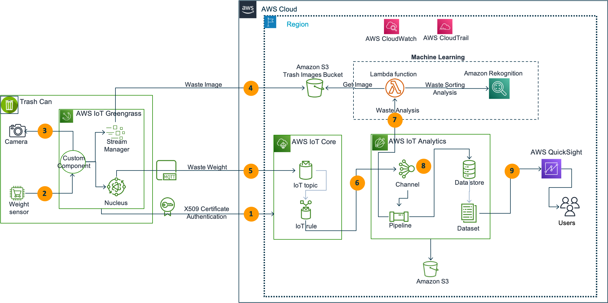

## AWS IoT Smart Wastebin solution

This post provides an example of how to build a connected Trash Can IoT solution for local councils.
As the IoT use cases involve complex ecosystem of technologies right from sensor, device management
all the way through to analytics layer, the serverless architecture is great way to start small, validate and
deploy at scale.
Hence this post walks you through AWS serverless key architecture components around device
provisioning, ingesting trash images and waste weight data through AWS IoT Core into AWS IoT
Analytics, analyze trash image using Amazon Rekognition to enrich waste data and finally store into
Amazon S3 storage for building waste heat map using Amazon QuickSight

### Architecture

Target architecture:

  

### Usage

#### Prerequisites

To deploy the solution, you need an AWS account. If you don’t already have an AWS account,
create one at <https://aws.amazon.com> by following the on-screen instructions.
Your access to the AWS account must have IAM permissions to launch AWS CloudFormation templates that create IAM roles.

#### Deployment

The application is deployed as an [AWS CloudFormation](https://aws.amazon.com/cloudformation) template.

> **Note**
You are responsible for the cost of the AWS services used while running this sample deployment. There is no additional
cost for using this sample. For full details, see the pricing pages for each AWS service that you use in this sample. Prices are subject to change.

1. Deploy the latest CloudFormation template by following the link below for your preferred AWS region:

|Region|Launch Template|
|------|---------------|
|**US East (N. Virginia)** (us-east-1) | |
|**US West (Oregon)** (us-west-2) | |
|**EU (Ireland)** (eu-west-1) | |
|**EU (London)** (eu-west-2) | |
|**EU (Frankfurt)** (eu-central-1) | |
|**AP (Sydney)** (ap-southeast-2) | |

2. If prompted, login using your AWS account credentials.
1. You should see a screen titled "*Create Stack*" at the "*Specify template*" step. The fields specifying the CloudFormation
   template are pre-populated. Choose the *Next* button at the bottom of the page.
1. On the "*Specify stack details*" screen you can customize the following parameters of the CloudFormation stack:

|Parameter label|Default|Description|
|---------------|-------|-----------|
|CreateMap|true|If True, this creates an Amazon Location Map.|
|MapName|ExampleMap01|Must be a unique map resource name. No spaces allowed. For example, ExampleMap.|
|MapPricingPlan|RequestBasedUsage|Specifies the pricing plan for your map resource.|
|MapStyle|VectorEsriStreets|Specifies the map style selected from an available data providers.|
|ResourceTags|LocationDetectApp|Tag resources, which can help you identify and categorize them.|
|Environment|DEV|The type of environment to tag your infrastructure with.|

When completed, choose *Next*
1. [Configure stack options](https://docs.aws.amazon.com/AWSCloudFormation/latest/UserGuide/cfn-console-add-tags.html) if desired, then choose *Next*.
1. On the review you screen, you must check the boxes for:
    * "*I acknowledge that AWS CloudFormation might create IAM resources*"
    * "*I acknowledge that AWS CloudFormation might create IAM resources with custom names*"
    * "*I acknowledge that AWS CloudFormation might require the following capability: CAPABILITY_AUTO_EXPAND*"

   These are required to allow CloudFormation to create a Role to grant access to the resources needed by the stack and name the resources in a dynamic way.
1. Choose *Create Stack*
1. Wait for the CloudFormation stack to launch. Completion is indicated when the "Stack status" is "*CREATE_COMPLETE*".
    * You can monitor the stack creation progress in the "Events" tab.

### Clean up

To remove the stack:

1. Open the AWS CloudFormation Console.
1. Choose the *smart-bin-demo-app * project, press "*Delete Stack*" button.
1. Your stack might take some time to be deleted. You can track its progress in the "Events" tab.
1. When it is done, the status changes from "DELETE_IN_PROGRESS" to "DELETE_COMPLETE". It then disappear from the list.

## Security

See [CONTRIBUTING](CONTRIBUTING.md#security-issue-notifications) for more information.

## License

This library is licensed under the MIT-0 License. See the LICENSE file.
